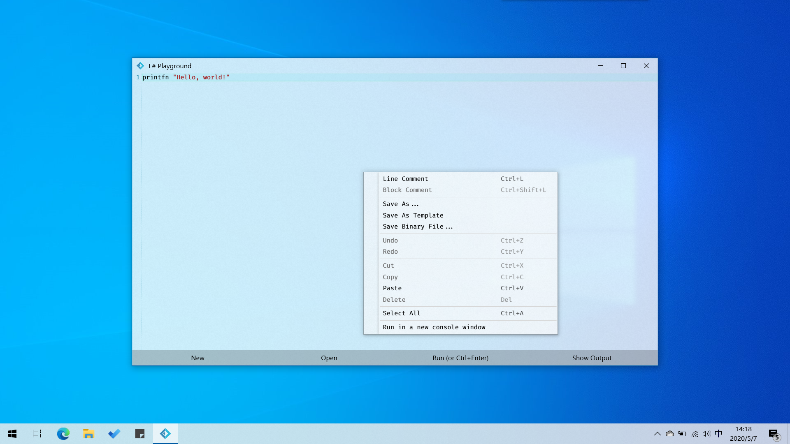

# F# Playground
The mini playground for [F# Programming Language](fsharp.org).    




# Load your favorite Library and Codes
Now you can load library and codes like this:
```fsharp
#I "C:\MyDLLs"
#I "C:\MyFSharpCodes"
#r "My.Favorite.dll"
#load "My.Favorite.fs"
```

# FAQ
##### FS8004:Assembly reference 'mscorlib.dll' was not found or is invalid
You can install 
[.NET Framework Dev Pack 4.6.2](https://dotnet.microsoft.com/download/dotnet-framework/thank-you/net462-developer-pack-offline-installer).

# Changelog

## v1.2
1. Update FSharp.Core to version 4.7.2.
1. Output window can be set to word wrap mode.
1. Remove .NET Core version.
1. Bug fix: Output window bugs.
1. Bug fix: Highlight bugs.
1. Bug fix: Code Runner bugs.


## v1.1
1. Save the program as DLL file.
1. Save and load "Code Template".
1. Run the program in a new console.
1. Compile and execute more efficiently.
1. Receive error message in stderr when the program fails.
1. \#r/#I/#load preprocessor instruction supported, loading .dll or .fs/.fsx/.fsscript file supported.
1. Syntax highlighting bug fixed, now the operator (*) can be rendering correctly.
1. Redirect stdout correctly to Output panel.
1. More intuitive and clean GUI.

# Thanks
* [Nyplus](https://github.com/hrukalive)
